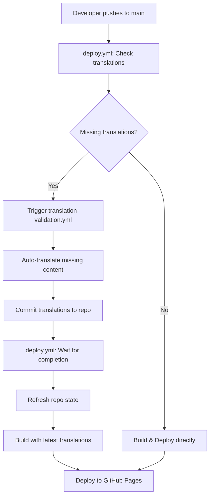

# GitHub Actions Setup for Automatic Translation & Deployment

## Required Setup Steps

### 1. Add OpenAI API Key Secret

1. Go to your GitHub repository
2. Navigate to **Settings** → **Secrets and variables** → **Actions**
3. Click **New repository secret**
4. Set:
   - **Name**: `OPENAI_API_KEY`
   - **Secret**: Your actual OpenAI API key (starts with `sk-...`)
5. Click **Add secret**

### 2. Enable GitHub Actions

Ensure GitHub Actions are enabled in your repository:
1. Go to **Settings** → **Actions** → **General**
2. Under "Actions permissions", select "Allow all actions and reusable workflows"
3. Under "Workflow permissions", select "Read and write permissions"
4. Check "Allow GitHub Actions to create and approve pull requests"

### 3. Enable GitHub Pages

1. Go to **Settings** → **Pages**
2. Under "Source", select "GitHub Actions"
3. The custom domain `blamegame.leagueoffun.de` should be automatically configured

### 4. Verify Workflow Files

The workflow files should be at:
- `.github/workflows/deploy.yml` (Main orchestrator)
- `.github/workflows/translation-validation.yml` (Translation service)

## How It Works

### Orchestrated Translation & Deployment Flow



### Workflow Separation

**deploy.yml** (Main Orchestrator):
- Triggered on push to main
- Checks for missing translations
- Triggers translation workflow if needed
- Waits for translation completion
- Builds and deploys to GitHub Pages

**translation-validation.yml** (Translation Service):
- Triggered by deploy.yml via workflow_dispatch
- Also triggered on direct pushes affecting translations
- Validates and auto-translates content
- Commits changes back to repository
- Does NOT deploy (deployment is handled by deploy.yml)

### Trigger Conditions

The workflows trigger under different conditions:

**deploy.yml (Main Orchestrator)**:
- **Push to main branch**: Checks translations, orchestrates translation if needed, then builds and deploys

**translation-validation.yml (Translation Service)**:
- **Push to main/develop**: Validates and auto-translates missing content
- **Pull requests to main**: Validation and build test only  
- **Workflow dispatch**: When triggered by deploy.yml for translation needs

### Translation Process

1. **Check**: deploy.yml checks if translations are missing
2. **Trigger**: If needed, triggers translation-validation.yml via workflow_dispatch
3. **Translate**: translation-validation.yml translates missing content
4. **Commit**: Auto-commits new translations with `[skip ci]` to avoid loops
5. **Wait**: deploy.yml waits for translation completion
6. **Refresh**: deploy.yml refreshes repository state with new translations
7. **Build**: Creates production build with complete translations
8. **Deploy**: Deploys to GitHub Pages with custom domain

## Commit Message Controls

### Skip Translation
To skip automatic translation on a specific commit:
```bash
git commit -m "Add new German questions [skip translate]"
```

### Skip CI Entirely
To skip all CI/CD actions:
```bash
git commit -m "Update documentation [skip ci]"
```

## Monitoring and Troubleshooting

### Check Workflow Status
1. Go to your repository on GitHub
2. Click the **Actions** tab
3. View recent workflow runs and their status

### Common Issues

#### Missing API Key
```
Error: OPENAI_API_KEY environment variable is required
```
**Solution**: Add the `OPENAI_API_KEY` secret in repository settings

#### Permission Denied
```
Error: Permission denied (publickey)
```
**Solution**: Ensure "Read and write permissions" are enabled in Actions settings

#### Workflow Dispatch Failed
```
Error: Could not trigger translation workflow
```
**Solution**: Check that translation-validation.yml exists and workflows have proper permissions

#### Translation Timeout
```
Translation workflow timeout - proceeding with deployment
```
**Solution**: Normal fallback behavior. Check translation workflow logs for specific issues

#### API Rate Limits
```
Rate limit reached. Waiting X seconds...
```
**Solution**: Normal behavior, the workflow will wait automatically

#### Translation Failures
```
❌ Translation failed for "question text": API error
```
**Solution**: Check your OpenAI API key and account status

### Viewing Translation Changes

When translations are automatically created:
1. Check commits by "GitHub Action" in the repository history
2. Review the changes in `public/questions/` directories
3. Files will show added/modified translations for missing content

## Cost Management

### OpenAI API Usage
- The system uses **gpt-3.5-turbo** (cost-effective model)
- Batch processing minimizes API calls
- Rate limiting prevents excessive usage
- Only translates missing content (not re-translating existing)

### Monitoring Costs
1. Check your OpenAI usage dashboard
2. Set up billing alerts in OpenAI account
3. Monitor GitHub Actions usage (free tier: 2000 minutes/month)

## Manual Override

If you need to bypass automatic translation:

### Temporarily Disable
1. Edit `.github/workflows/translation-validation.yml`
2. Add `if: false` to the `auto-translate-and-commit` job
3. Commit and push

### Run Translation Locally
```bash
export OPENAI_API_KEY="your-key-here"
npm run translate
git add public/questions/
git commit -m "Manual translation update"
git push
```

## Best Practices

1. **Review translations**: Check auto-translated content for quality
2. **Monitor costs**: Keep track of OpenAI API usage
3. **Test builds**: Verify application works after translation updates
4. **Backup strategy**: GitHub maintains version history of all translations
5. **Quality control**: Manually review important or sensitive content

This setup ensures your Blame Game always has complete translations across all supported languages without manual intervention!
