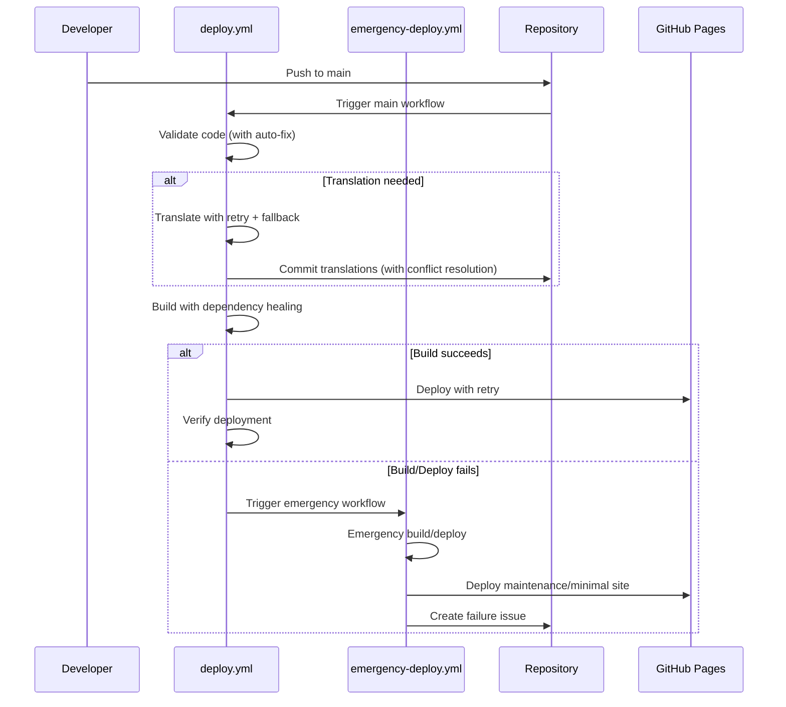

# Workflow Orchestration Guide

## Overview

BlameGame uses a **self-healing CI/CD workflow** for automated translation and deployment. This ensures robust, reliable, and maintainable deployment with automatic recovery from common failures.

## Workflow Architecture

### 🎯 Primary Workflow: `deploy.yml`
**Role**: Main CI/CD pipeline with self-healing capabilities
**Triggers**: Push to main branch, Pull requests
**Responsibilities**:
- Check and validate code quality
- Auto-translate missing content with fallback strategies
- Build application with dependency healing
- Deploy to GitHub Pages with retry mechanisms
- Generate self-healing reports

### � Emergency Workflow: `emergency-deploy.yml`
**Role**: Fallback deployment system
**Triggers**: 
- Automatic trigger when main workflow fails
- Manual trigger via workflow_dispatch
**Responsibilities**:
- Emergency deployment with minimal requirements
- Maintenance mode activation if needed
- Automatic issue creation for failed deployments
- Last-resort site availability guarantee

## Self-Healing Mechanisms

### ✅ **Translation Self-Healing**
- **Retry with Backoff**: 3 attempts with 30s intervals for API failures
- **Fallback Strategy**: Use cached translations when API completely fails
- **Smart Git Operations**: Auto-rebase on push conflicts

### ✅ **Build System Self-Healing**
- **Dependency Healing**: Auto-regenerate lock files on corruption
- **Cache Management**: Progressive cache clearing strategies
- **Multi-Strategy Builds**: Fallback build configurations

### ✅ **Deployment Self-Healing**
- **Retry Deployment**: 3 attempts with exponential backoff
- **Emergency Fallback**: Automatic trigger of emergency workflow
- **Health Verification**: Post-deployment site accessibility checks

### ✅ **Code Quality Self-Healing**
- **Auto-Fix Linting**: Automatic code formatting where possible
- **Graceful Degradation**: Continue with warnings rather than fail

## Self-Healing Flow



## Key Self-Healing Features

### 🔄 **Progressive Recovery Strategies**
1. **Step-level**: Retry individual operations with backoff
2. **Job-level**: Alternative approaches within the same job
3. **Workflow-level**: Emergency deployment activation
4. **System-level**: Maintenance mode with issue tracking

### 🛡️ **Failure Resilience**
- **API Failures**: Graceful fallback to cached content
- **Build Failures**: Multiple build strategies and emergency deployment
- **Git Conflicts**: Automatic conflict resolution and rebase
- **Dependency Issues**: Cache clearing and lock file regeneration

### 📊 **Monitoring and Reporting**
- **Self-Healing Reports**: Detailed summary of recovery actions taken
- **Automatic Issue Creation**: For persistent failures requiring manual intervention
- **Health Checks**: Post-deployment verification and monitoring

## Configuration Requirements

### Repository Secrets
```
OPENAI_API_KEY: your-openai-api-key-here
```

### GitHub Settings
- **Actions**: Read and write permissions enabled
- **Pages**: Source set to "GitHub Actions"
- **Workflows**: Both workflows committed to `.github/workflows/`

### Custom Domain
- **Domain**: `blamegame.leagueoffun.de`
- **CNAME**: Automatically created during build
- **DNS**: Configured externally

## Usage Examples

### Normal Development Flow
```bash
# Add new questions in German
git add public/questions/de/
git commit -m "Add new party questions"
git push origin main

# Result: Auto-translates to EN/ES/FR, then deploys
```

### Skip Translation
```bash
git commit -m "Add questions [skip translate]"
# Result: Deploys without translation check
```

### Manual Translation Testing
```bash
# Run locally first
export OPENAI_API_KEY="your-key"
pnpm run translate:check
pnpm run translate

# Then commit
git add public/questions/
git commit -m "Manual translation update"
git push
```

## Monitoring and Debugging

### Workflow Status
1. Go to **Actions** tab in GitHub
2. Monitor both workflows:
   - `🚀 Deploy Blame Game to GitHub Pages`
   - `🌍 Translation Validation and Update`

### Common Scenarios

#### Scenario 1: No Missing Translations
```
deploy.yml:
✅ Check translations → No missing content
✅ Build and deploy directly
⏱️ Total time: ~3-5 minutes
```

#### Scenario 2: Missing Translations
```
deploy.yml:
✅ Check translations → Missing content detected
🔄 Trigger translation-validation.yml
⏳ Wait for completion

translation-validation.yml:
✅ Validate → Auto-translate → Commit

deploy.yml:
🔄 Refresh repository state
✅ Build with new translations → Deploy
⏱️ Total time: ~8-12 minutes
```

#### Scenario 3: Translation Failure
```
deploy.yml:
✅ Check translations → Missing content
🔄 Trigger translation workflow
❌ Translation workflow fails/times out
⚠️ Continue with existing translations
✅ Deploy anyway
⏱️ Total time: ~6-8 minutes
```

## Best Practices

### For Developers
1. **Test locally**: Run `pnpm run translate:check` before pushing
2. **Review auto-translations**: Check committed translations for quality
3. **Use skip flags**: Add `[skip translate]` when appropriate
4. **Monitor costs**: Keep track of OpenAI API usage

### For Maintainers
1. **Monitor workflows**: Check Actions tab regularly
2. **Update dependencies**: Keep workflow actions up to date
3. **Review logs**: Check for translation quality issues
4. **Backup strategy**: Repository history serves as backup

## Troubleshooting

### Translation Workflow Not Triggered
```yaml
# Check deploy.yml has:
- name: 🚀 Trigger Translation Workflow
  if: steps.translation-check.outputs.needs-translation == 'true'
  uses: actions/github-script@v7
```

### Workflow Dispatch Fails
- Verify both workflow files exist
- Check repository permissions
- Ensure `workflow_dispatch` trigger is configured

### Build Failures After Translation
- Check translation file syntax
- Validate JSON formatting
- Run `pnpm run translate:validate` locally

### Deployment Issues
- Verify GitHub Pages settings
- Check CNAME file creation
- Validate custom domain configuration

## Future Enhancements

### Potential Improvements
1. **Parallel translation**: Translate multiple languages simultaneously
2. **Smart caching**: Cache unchanged translations
3. **Quality scoring**: Implement translation quality metrics
4. **Rollback mechanism**: Quick rollback for failed deployments
5. **Multi-environment**: Support staging/production environments

This orchestrated approach ensures BlameGame maintains high-quality, complete translations while providing reliable, automated deployment to production.
