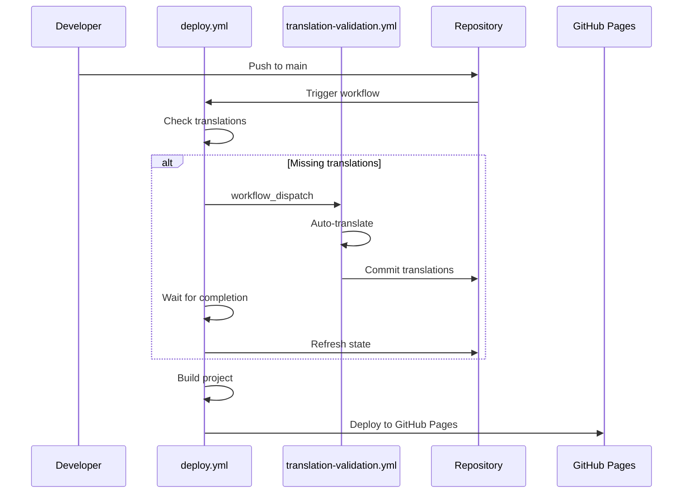

# Workflow Orchestration Guide

## Overview

BlameGame uses an orchestrated dual-workflow system for automated translation and deployment. This ensures robust, reliable, and maintainable CI/CD with clear separation of concerns.

## Workflow Architecture

### 🎯 Primary Workflow: `deploy.yml`
**Role**: Main orchestrator and deployment manager
**Triggers**: Push to main branch
**Responsibilities**:
- Check translation status
- Trigger translation workflow when needed
- Wait for translation completion
- Build and deploy to GitHub Pages

### 🌍 Secondary Workflow: `translation-validation.yml`
**Role**: Translation service and validation
**Triggers**: 
- Workflow dispatch (from deploy.yml)
- Direct pushes affecting translations
- Pull requests (validation only)
**Responsibilities**:
- Validate existing translations
- Auto-translate missing content
- Commit translations back to repository
- Build testing for PRs

## Orchestration Flow



## Key Features

### ✅ Separation of Concerns
- **deploy.yml**: Focuses solely on orchestration and deployment
- **translation-validation.yml**: Handles only translation logic

### ✅ Atomic Operations
- Translation commits are separate from deployment
- Each workflow has a single, clear responsibility
- No deployment conflicts or race conditions

### ✅ Robust Error Handling
- Translation failures don't block deployment
- Timeout protection for translation workflows
- Graceful fallbacks when translation isn't needed

### ✅ Efficient Resource Usage
- Only runs translation when actually needed
- Skips unnecessary steps based on translation status
- Rate limiting and cost optimization

## Configuration Requirements

### Repository Secrets
```
OPENAI_API_KEY: your-openai-api-key-here
```

### GitHub Settings
- **Actions**: Read and write permissions enabled
- **Pages**: Source set to "GitHub Actions"
- **Workflows**: Both workflows committed to `.github/workflows/`

### Custom Domain
- **Domain**: `blamegame.leagueoffun.de`
- **CNAME**: Automatically created during build
- **DNS**: Configured externally

## Usage Examples

### Normal Development Flow
```bash
# Add new questions in German
git add public/questions/de/
git commit -m "Add new party questions"
git push origin main

# Result: Auto-translates to EN/ES/FR, then deploys
```

### Skip Translation
```bash
git commit -m "Add questions [skip translate]"
# Result: Deploys without translation check
```

### Manual Translation Testing
```bash
# Run locally first
export OPENAI_API_KEY="your-key"
pnpm run translate:check
pnpm run translate

# Then commit
git add public/questions/
git commit -m "Manual translation update"
git push
```

## Monitoring and Debugging

### Workflow Status
1. Go to **Actions** tab in GitHub
2. Monitor both workflows:
   - `🚀 Deploy Blame Game to GitHub Pages`
   - `🌍 Translation Validation and Update`

### Common Scenarios

#### Scenario 1: No Missing Translations
```
deploy.yml:
✅ Check translations → No missing content
✅ Build and deploy directly
⏱️ Total time: ~3-5 minutes
```

#### Scenario 2: Missing Translations
```
deploy.yml:
✅ Check translations → Missing content detected
🔄 Trigger translation-validation.yml
⏳ Wait for completion

translation-validation.yml:
✅ Validate → Auto-translate → Commit

deploy.yml:
🔄 Refresh repository state
✅ Build with new translations → Deploy
⏱️ Total time: ~8-12 minutes
```

#### Scenario 3: Translation Failure
```
deploy.yml:
✅ Check translations → Missing content
🔄 Trigger translation workflow
❌ Translation workflow fails/times out
⚠️ Continue with existing translations
✅ Deploy anyway
⏱️ Total time: ~6-8 minutes
```

## Best Practices

### For Developers
1. **Test locally**: Run `pnpm run translate:check` before pushing
2. **Review auto-translations**: Check committed translations for quality
3. **Use skip flags**: Add `[skip translate]` when appropriate
4. **Monitor costs**: Keep track of OpenAI API usage

### For Maintainers
1. **Monitor workflows**: Check Actions tab regularly
2. **Update dependencies**: Keep workflow actions up to date
3. **Review logs**: Check for translation quality issues
4. **Backup strategy**: Repository history serves as backup

## Troubleshooting

### Translation Workflow Not Triggered
```yaml
# Check deploy.yml has:
- name: 🚀 Trigger Translation Workflow
  if: steps.translation-check.outputs.needs-translation == 'true'
  uses: actions/github-script@v7
```

### Workflow Dispatch Fails
- Verify both workflow files exist
- Check repository permissions
- Ensure `workflow_dispatch` trigger is configured

### Build Failures After Translation
- Check translation file syntax
- Validate JSON formatting
- Run `pnpm run translate:validate` locally

### Deployment Issues
- Verify GitHub Pages settings
- Check CNAME file creation
- Validate custom domain configuration

## Future Enhancements

### Potential Improvements
1. **Parallel translation**: Translate multiple languages simultaneously
2. **Smart caching**: Cache unchanged translations
3. **Quality scoring**: Implement translation quality metrics
4. **Rollback mechanism**: Quick rollback for failed deployments
5. **Multi-environment**: Support staging/production environments

This orchestrated approach ensures BlameGame maintains high-quality, complete translations while providing reliable, automated deployment to production.
