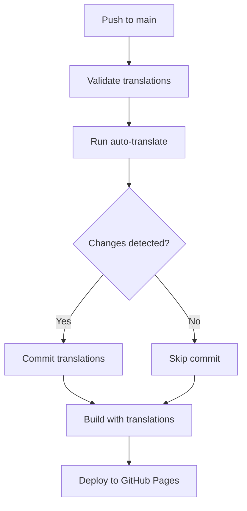

# Translation Configuration

## Environment Variables

Set your OpenAI API key:
```bash
export OPENAI_API_KEY="your-api-key-here"
```

Or on Windows:
```cmd
set OPENAI_API_KEY=your-api-key-here
```

## Usage

### Check Translation Status (Dry Run)
```bash
npm run translate:check
```
This shows what would be translated without making changes.

### Run Full Translation
```bash
npm run translate
```
This translates missing content and updates files (creates backup first).

### Force Translation (No Backup)
```bash
npm run translate:force
```
**⚠️ Use with caution** - skips backup creation.

### Build with Translation Check
```bash
npm run build:production
```
Checks translations, builds, and verifies assets.

## Configuration Options

The translation system can be configured by editing `scripts/auto-translate.js`:

```javascript
const CONFIG = {
  languages: ['de', 'en', 'es', 'fr'],     // Supported languages
  baseLanguage: 'de',                       // Primary source language
  fallbackLanguage: 'en',                  // Secondary source language
  openaiModel: 'gpt-3.5-turbo',           // OpenAI model to use
  maxTokens: 150,                          // Max tokens per translation
  temperature: 0.3,                        // Translation creativity (0-1)
  batchSize: 10,                           // Questions per API call
  backupEnabled: true,                     // Create backups before changes
  dryRun: false                            // Preview mode
};
```

## Supported Languages

- **de** (German) - Primary language
- **en** (English) - Fallback language  
- **es** (Spanish)
- **fr** (French)

## File Structure

The system expects this structure:
```
public/questions/
├── categories.json          # Category definitions with translations
├── de/                      # German questions
│   ├── category1.json
│   └── category2.json
├── en/                      # English questions
├── es/                      # Spanish questions
└── fr/                      # French questions
```

## Translation Process

1. **Category Analysis**: Scans all category files across languages
2. **Missing Detection**: Identifies missing categories and questions
3. **API Translation**: Uses OpenAI to translate missing content
4. **File Updates**: Updates JSON files with new translations
5. **Validation**: Verifies structure and consistency

## Error Handling

- **API Failures**: Logged and skipped, process continues
- **Rate Limits**: Automatic waiting with progress indicators
- **Invalid JSON**: Reported but doesn't stop translation
- **Missing Files**: Created as needed
- **Backup**: Always created before modifications (unless disabled)

## Quality Assurance

- **Context-Aware**: Translations include game context
- **Tone Preservation**: Maintains fun, casual party game tone
- **Cultural Adaptation**: Adjusts humor for target language
- **Consistency**: Maintains questionId across languages
- **Validation**: Checks JSON structure after translation

## Troubleshooting

### API Key Issues
```
❌ OPENAI_API_KEY environment variable is required
```
**Solution**: Set your OpenAI API key as environment variable

### Rate Limiting
```
Rate limit reached. Waiting X seconds...
```
**Solution**: Normal behavior, the system waits automatically

### Missing Files
```
⚠️ Missing file: en/new_category.json
```
**Solution**: Files are created automatically during translation

### JSON Errors
```
❌ Failed to parse de/category.json: Unexpected token
```
**Solution**: Fix JSON syntax manually or restore from backup

## Backup and Recovery

Backups are stored in `translation-backups/backup-TIMESTAMP/`

To restore a backup:
```bash
cp -r translation-backups/backup-2025-06-17T10-30-00-000Z/* public/questions/
```

## Integration with Build Process

The enhanced build scripts automatically check translations:

- `npm run build:production` - Includes translation verification
- `npm run verify-assets` - Now includes translation checks
- `npm run translate:check` - Pre-build translation validation

### GitHub Actions Deployment

The system includes automatic translation during deployment:

1. **Translation Validation**: Checks translation completeness on every push/PR
2. **Automatic Translation**: Runs full translation on main branch pushes
3. **Auto-commit**: Commits new translations back to repository
4. **Build & Deploy**: Builds with complete translations and deploys

#### Required GitHub Secrets

Set up the following secret in your GitHub repository settings:

- `OPENAI_API_KEY`: Your OpenAI API key for automatic translations

#### Workflow Process



The workflow automatically:
- ✅ Validates existing translations
- ✅ Translates missing content using OpenAI API
- ✅ Commits new translations with message `🌍 Auto-translate: Update translations [skip ci]`
- ✅ Builds application with complete translations
- ✅ Deploys to GitHub Pages with custom domain

#### Manual Translation Control

To skip automatic translation on specific commits, include `[skip translate]` in your commit message:
```bash
git commit -m "Add new questions [skip translate]"
```

### GitHub Repository Setup

For automatic translation during deployment, you need to configure your GitHub repository:

1. **Add Secret**: Add `OPENAI_API_KEY` secret in repository settings
2. **Enable Actions**: Allow read/write permissions for GitHub Actions
3. **Custom Domain**: The workflow deploys to `blamegame.leagueoffun.de`

See [GITHUB_ACTIONS_SETUP.md](GITHUB_ACTIONS_SETUP.md) for detailed setup instructions.

## Best Practices

1. **Always run dry-run first**: `npm run translate:check`
2. **Check translations manually**: Review generated content
3. **Commit translations**: Include in version control
4. **Test after translation**: Verify game functionality
5. **Monitor API usage**: Track OpenAI costs
